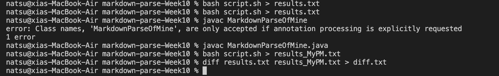
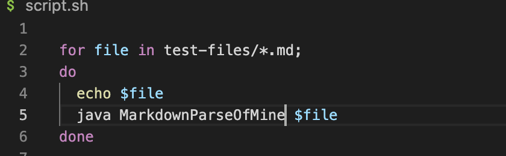
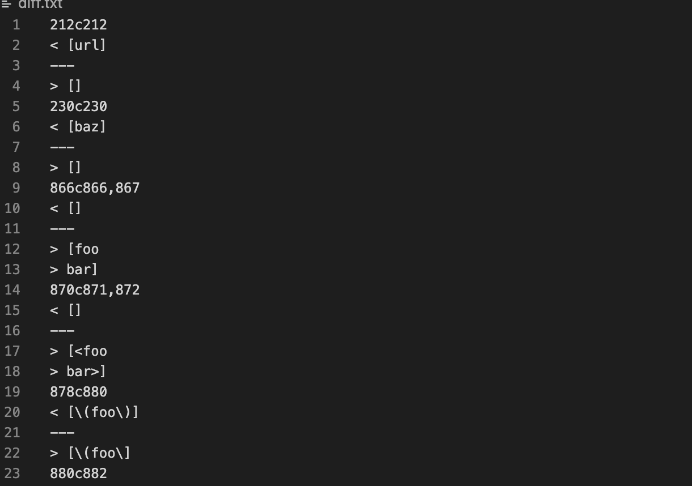
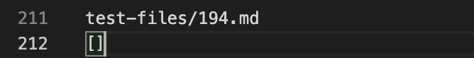
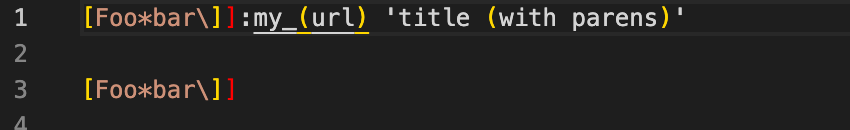
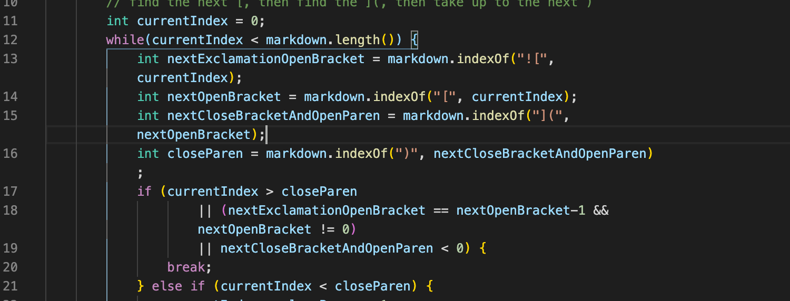

# CSE 15L Week10 - Diff

## diffrent results of two codes
 These are the command line I used

``bash script.sh > results.md`` gives the results by given MarkdownParse

Then I edited the script.sh file, to have the result of my MarkdownParse code

Then ``javac MarkdownParseOfMine.java`` to have a class file
``bash script.sh > result_MyPM.md`` give the results by my MarkdownParse

use ``diff script.txt script_MyPM.md > diff.txt`` to have a file to record the diffrent of the results

The first different happened is in file 212, so we can locate it at file 194

That is what file 194 looks like

The given code have ``[url]``, while my code have ``[]``

I think given code is corret, while mine got bug in here. bacause by the file194 showed above, the correct output shouls be [url]

## Correctness

In the line of 14 of my code, it first looking for open backet "[", then find the close backet "]" combin with open parentheses "(" as "](". As the result, it only can detect the link when nothing between "]" and "(".
The solution would be best to have sperated line 14 into 2 parts, as 
``int nextCloseBracket = markdown.indexOf("](", nextOpenBracket);``
``int OpenParen = markdown.indexOf("](", nextOpenBracket);``