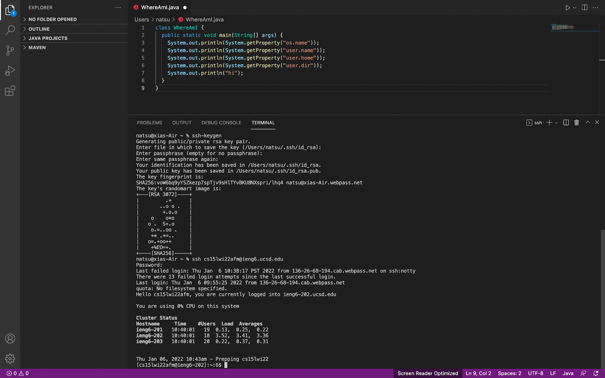

# CSE Lab Report Week 2

## Installing VScode

    Google VScode or click the URL here [VScode Website](https://code.visualstudio.com/)
    Download the one that match to the system of your computer
## turn on the VScode

    the look of the VScode when you are in, terminal downside is place that you can manipulate and make the command
    main certral part is the place that ususally you edit your prgram
    left side is the place you manager or overlook the structure of your project and select the file. You may get also get some useful extension here 
## Remotely Connecting

    in the terminal, type or paste with "ssh + your account to server", then if work well, you will be ask for password
    you cannot see the password you type in, but they are really there. After type or paste password with all blanks, press enter to connect the server
## Trying Some Commands

    command ls will return a list of all files in your reccent directory
    command cd stand for change directory, you can add path after cd to change the current directroy
## Moving Files with scp

    scp is secure copy of a local file to the server
    here you can see I copy the Week2 to the server
## Setting an SSH Key

    here you set up a public or private ssh key in a particualr location with your own password
    the main point is to save the work to repeating config happen when accessing the server
## Optimizing Remote Running

    with the command as you did for ssh, then follow with a command such as ls, then it will execute not only ssh, but ls and exit 