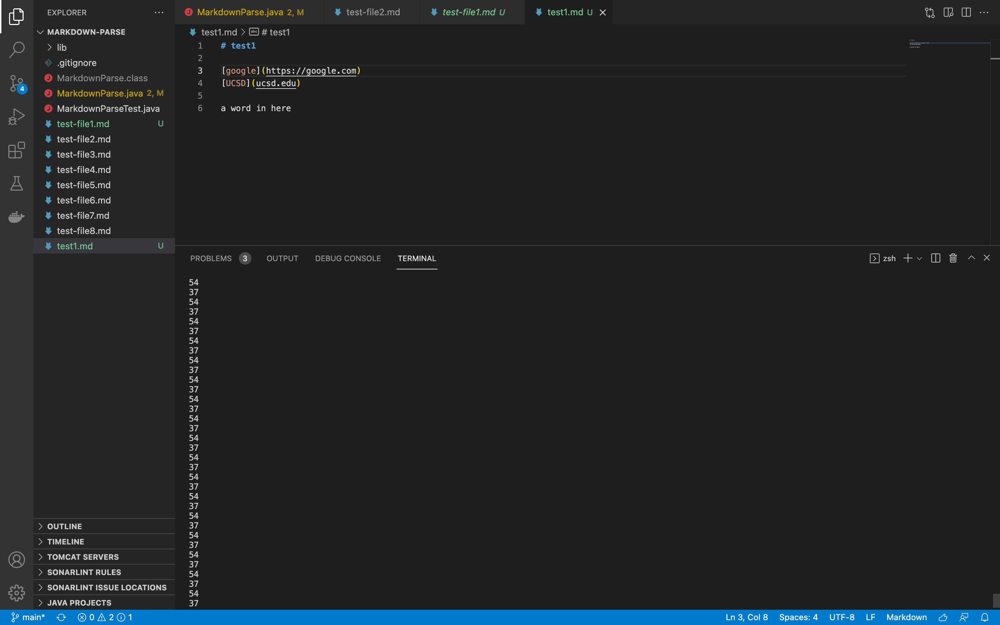
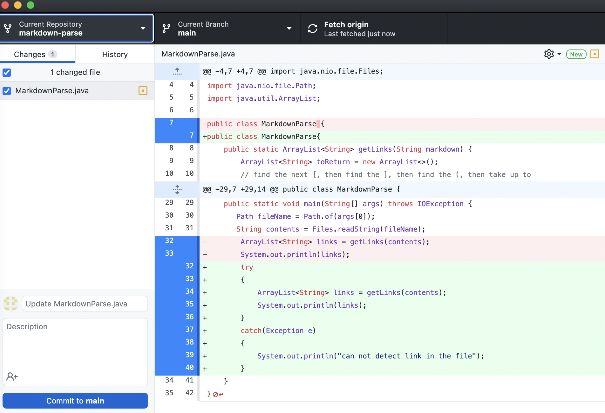
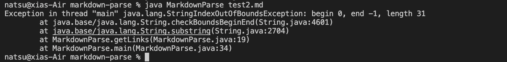
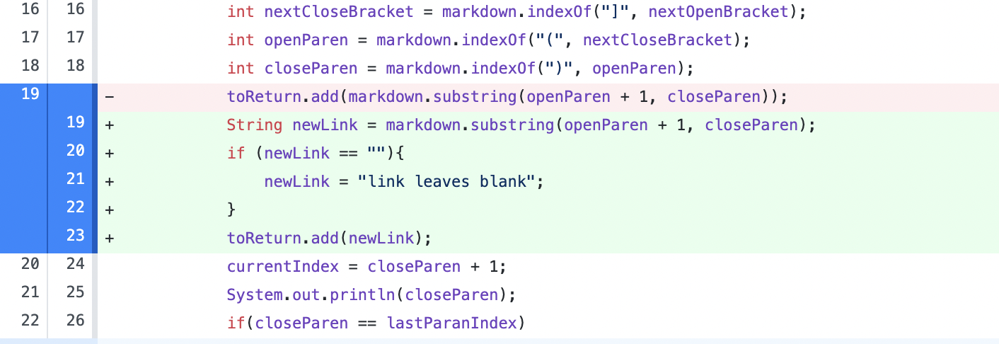
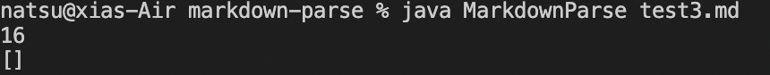

# CSE 15L Week4 - DEBUG

## 1

The file I tested in [test1](https://github.com/xiaoxia-xia/markdown-parse/blob/main/test1.md), https://github.com/xiaoxia-xia/markdown-parse/blob/main/test1.md

infinite loop: The original one doesn't consider existence of the word after link, so that program keep reading the String after last "("

Description: Adding the break law that if meet the last ")", then quit the while loop. The word after ")" will be ignored. As test shown, this ignor the messy word after link, do quit the while loop. Otherwise, even thoguh the output the correct, the program never finish

## 2 

The file I tested in [test2](https://github.com/xiaoxia-xia/markdown-parse/blob/main/test2.md), https://github.com/xiaoxia-xia/markdown-parse/blob/main/test2.md

outOfIndex exception: Since program will detect the [] then search (), but some time is lack of link in the file

Description: Add the try and catch in case of the exception. If the exception caught, tell the user that "can not detect the link in the file". Other while, give the link as desired.

## 3

The file I tested in [test3](https://github.com/xiaoxia-xia/markdown-parse/blob/main/test3.md), https://github.com/xiaoxia-xia/markdown-parse/blob/main/test3.md

If () leave the blank, the array will not keep anything, neither tell the user leaves the blank place

Description: the link is expected to caught in paren. if the thing inside is blank, program leave the note "the paren leaves blank".  Otherwise, print out the link as desired.