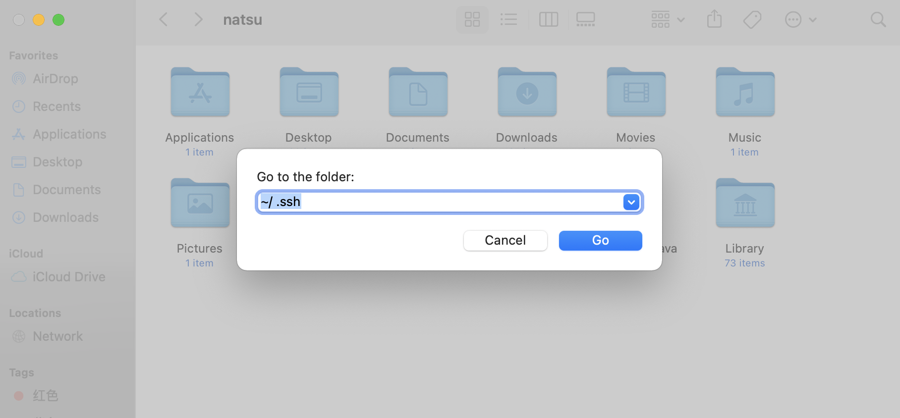
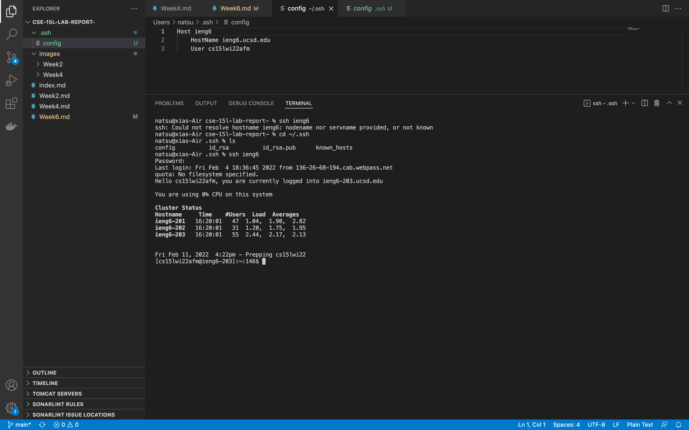
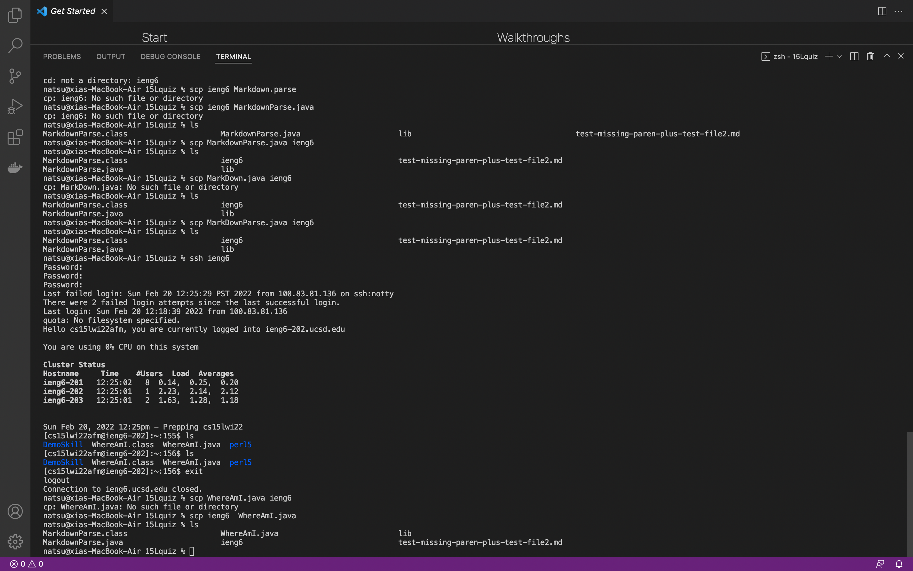

# CSE 15L Week6 - Streamline ssh Configuration

## .ssh folder is hidden on Mac System, enter folder by search
So when I was in the user folder, there is no such folder named .ssh, neitehr can create one, since alarming says .name folder reserved for system.

Then by press "cmd + shift + g", as 

Then create file name config, with cmd line inside as
```
Host ieng6
   HostName ieng6.ucsd.edu
   User cs15lwi22afm
```

Lastly, back to terminal, change direcotry to ~/.ssh, give the cmd `ssh ieng6`



I use `scp ieng6 WhereAmI` to get a copy of WhereAmI from server to my laptop, as shown below

