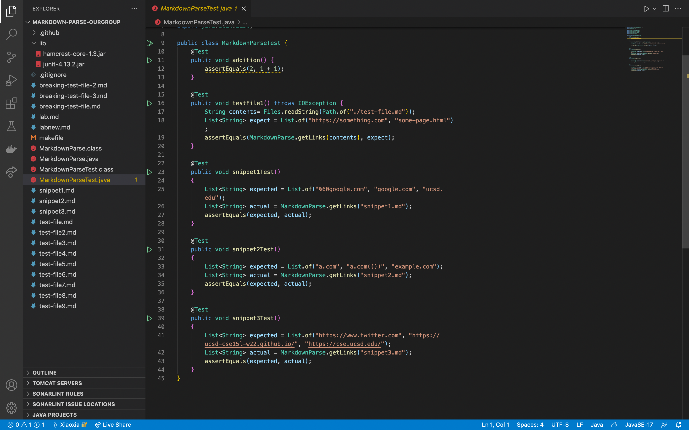

[Other group repo](https://github.com/codyprupp/markdown-parse)

[Our group repo](https://github.com/PierreBeur/markdown-parse)

## this is how it shows on [common mark](https://spec.commonmark.org/dingus/)

With makefile as below:

in the terminal, we type `make test`

This is the tester in both of two folder

This is the output of snippets of our group repo

This is hte output of snippets of other group repo

## 1.Do you think there is a small (<10 lines) code change that will make your program work for snippet 1 and all related cases that use inline code with backticks? If yes, describe the code change. If not, describe why it would be a more involved change.

Yes, there are two backticks to make the capturing text different front of text, we should check first by condition statement to avoid. The thing inside of backticks and bracket should be treated as link.

## 2.Do you think there is a small (<10 lines) code change that will make your program work for snippet 1 and all related cases that use inline code with backticks? If yes, describe the code change. If not, describe why it would be a more involved change.

Yes. There are some bracket inside of braket. The program should detect it is useless braket and ignore them. This can accomplished by adding some condition statment, mark the place of useless braket, and over them next time.

## 3.Do you think there is a small (<10 lines) code change that will make your program work for snippet 1 and all related cases that use inline code with backticks? If yes, describe the code change. If not, describe why it would be a more involved change.

Yes. There is one has missing close parenthesis. So the program will continue to check the next clpse parenthessis to run over the whole file. We can add some checking condition for next open backet and closed backet, indicating next link begins, so we add an addional close parenthesis on the propriate place.