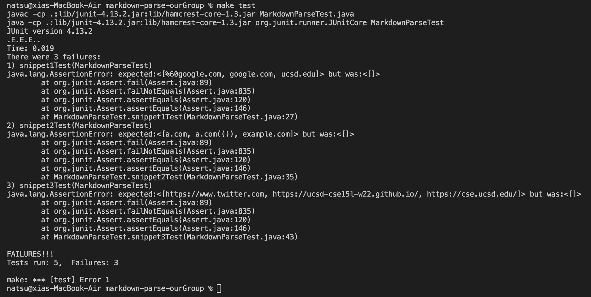

[Other group repo](https://github.com/codyprupp/markdown-parse)
[Our group repo](https://github.com/PierreBeur/markdown-parse)

## this is how it shows on [common mark](https://spec.commonmark.org/dingus/)

With makefile as below:

in the terminal, we type `make test`

This is the output of snippets of our group repo

This is hte output of snippets of other group repo
